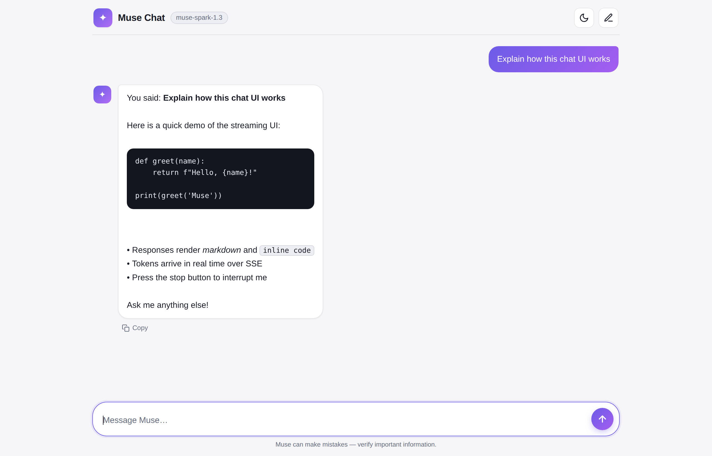

# ✦ Muse Chat

A modern, responsive, streaming AI chat UI that runs entirely on **Cloudflare Workers**.
Connect your GitHub repo, add your Muse API key as an environment variable, and you're live.



## Features

- **Real-time streaming** — answers render token-by-token over Server-Sent Events, with a typing indicator and a blinking caret
- **API key stays server-side** — the browser only ever talks to your Worker (`/api/chat`); the Muse key lives in Worker secrets and is never exposed
- **Muse API, easily configurable** — endpoint, key, model, and an optional system prompt are all environment variables; no code changes needed
- **Modern, mobile-friendly UI** — light/dark theme, markdown + code block rendering, copy buttons, stop generation, retry, suggestion chips, safe-area aware layout
- **Production-ready defaults** — same-origin protection, request size limits, upstream error forwarding, and a built-in mock API for local testing
- **Zero build step** — plain HTML/CSS/JS front end, one Worker file; deploy straight from GitHub

## How it works

```
Browser ──POST /api/chat──▶ Cloudflare Worker ──Bearer key──▶ Muse API (SSE)
   ▲                             │
   └────── streamed deltas ◀─────┘

Static UI (public/) is served by the same Worker via the ASSETS binding.
The API key only exists in Worker environment variables — never in the client.
```

## Project structure

```
muse-chat/
├── public/               # Static front end (served by the Worker)
│   ├── index.html
│   ├── style.css         # Theme tokens at the top — easiest place to re-skin
│   └── app.js            # Chat logic + CONFIG block for customization
├── src/
│   └── index.js          # The Worker: serves assets + proxies /api/chat with streaming
├── scripts/
│   └── mock-server.mjs   # OpenAI-compatible mock Muse API for local testing
├── docs/                 # Screenshots
├── wrangler.jsonc        # Cloudflare config (name, assets, default vars)
├── .dev.vars.example     # Template for local secrets
├── package.json
└── LICENSE
```

## Configuration (environment variables)

Set these in the Cloudflare dashboard (**Worker → Settings → Variables and Secrets**) or locally in `.dev.vars`:

| Variable             | Required | Type            | Example / Default                  | Purpose                                                        |
| -------------------- | -------- | --------------- | ---------------------------------- | -------------------------------------------------------------- |
| `MUSE_API_KEY`       | ✅       | **Secret**      | `LLM\|...`                          | Your Muse API key — stored encrypted, never sent to the browser |
| `MUSE_API_ENDPOINT`  | –        | Text (or Secret)| `https://api.meta.ai/v1` (default)  | Muse API base URL **or** full chat-completions URL              |
| `MUSE_MODEL`         | –        | Text            | `muse-spark-1.3` (default)          | Model name sent to the API                                      |
| `SYSTEM_PROMPT`      | –        | Text            | `You are a helpful assistant.`      | Optional server-side system prompt for every conversation       |

> The endpoint accepts any of these forms and normalizes them automatically:
> `https://api.meta.ai/v1` · `https://api.meta.ai/v1/` · `https://api.meta.ai/v1/chat/completions`
> Any OpenAI-compatible gateway works too — just change the URL and model.

## Deploy from GitHub to Cloudflare (recommended)

1. **Push this project to a GitHub repository.**

2. In the [Cloudflare dashboard](https://dash.cloudflare.com/), go to **Workers & Pages** → **Create application** → **Import a repository**.

3. Authorize GitHub if asked, then select this repository.

4. In the build settings, keep the defaults:
   - **Deploy command:** `npx wrangler deploy`
   - Leave the build command empty (there is nothing to build).
   - The Worker name must match `"name"` in `wrangler.jsonc` (`muse-chat`) — if you rename it in the dashboard, rename it in `wrangler.jsonc` too.

5. Click **Save and Deploy**. Your chat UI is live on a `*.workers.dev` URL.

6. **Add your API key** (one time): open your Worker → **Settings** → **Variables and Secrets** → **Add**:
   - Type: **Secret**
   - Name: `MUSE_API_KEY`
   - Value: *your Muse API key*

   Optionally override `MUSE_API_ENDPOINT` / `MUSE_MODEL` as plain-text variables.

7. Open the Worker URL — the model tag in the header confirms which model you're talking to. If you see the red "not configured" banner, the key/endpoint variables are missing or misspelled.

### Deploy via CLI (alternative)

```bash
npm install
npx wrangler login
npx wrangler secret put MUSE_API_KEY   # paste your key when prompted
npx wrangler deploy                    # prints your live URL
```

## Local development

```bash
npm install
npm run mock        # terminal 1: mock Muse API on http://127.0.0.1:8788
npm run dev         # terminal 2: app on http://127.0.0.1:8787
```

```bash
cp .dev.vars.example .dev.vars   # already points at the mock server
```

- Any message containing **`JSON_MODE`** makes the mock return non-streaming JSON, so you can test that fallback path too.
- To test against the real Muse API locally, set `MUSE_API_ENDPOINT=https://api.meta.ai/v1` and your real key in `.dev.vars` (git-ignored).

## Customization

| Want to change…            | Where                                                              |
| -------------------------- | ------------------------------------------------------------------ |
| Colors / theme             | `public/style.css` → token blocks at the top (`:root`, dark block)  |
| Name, tagline, placeholder | `public/index.html`                                                 |
| Suggestion chips, history length | `CONFIG` object at the top of `public/app.js`                |
| Assistant persona          | `SYSTEM_PROMPT` environment variable                                |
| Rate limits / message caps | `LIMITS` object in `src/index.js`                                   |
| Branding font              | `font-family` in `public/style.css` (system stack by default)       |

## Troubleshooting

| Symptom                                   | Fix                                                                                     |
| ----------------------------------------- | --------------------------------------------------------------------------------------- |
| Red "Server is not configured" banner     | `MUSE_API_KEY` and/or `MUSE_API_ENDPOINT` are not set on the deployed Worker             |
| `Muse API responded with HTTP 401`        | Wrong API key — re-set the `MUSE_API_KEY` secret                                         |
| `Muse API responded with HTTP 404`        | Wrong endpoint/model — check `MUSE_API_ENDPOINT` and `MUSE_MODEL`                        |
| `Muse API responded with HTTP 400`        | Your model rejected a parameter; this project only sends `model`, `messages`, `stream`   |
| Build fails after connecting the repo     | Worker name in the dashboard must match `wrangler.jsonc`'s `name`                        |
| No streaming, answer appears all at once  | Some proxies buffer SSE; the Worker already sets `X-Accel-Buffering: no` and `no-transform` |

## Security notes

- The API key is only ever read server-side (`env.MUSE_API_KEY`) and never included in any response.
- `/api/chat` enforces same-origin `POST`s, caps request size and history length, and forwards upstream errors without leaking your key.
- The front end escapes all model output before rendering (safe mini-markdown: code blocks, bold, italic, links, lists).

## License

[MIT](LICENSE) — customize it, ship it, make it yours.
